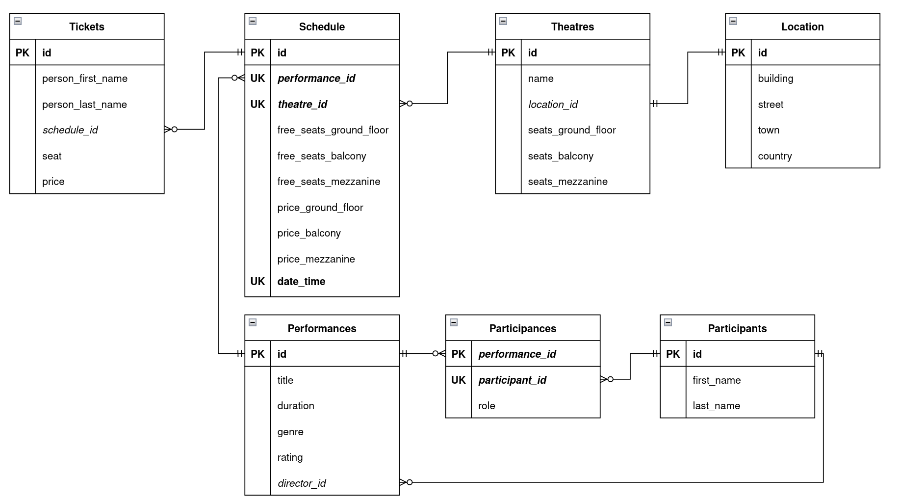

# Театральная касса

## Схема базы данных

## Описание страниц

Есть главное меню, доступное на всех страницах:

* Главная страница
* Представления
* Театры

### Главная страница

* список представлений (топ-10 по рейтингу)
* переход на другие страницы либо по ссылке из списка представлений, либо через главное меню

### Представления

* список всех представлений
* возможность вывода по театрам, жанрам, известным артистам, датам (через listbox или что-то подобное)
* кнопка Добавить представление

### Информация о представлении (своя для каждого представления)

* общая информация о представлении (название, длительность, список артистов, жанр, режиссер)
* расписание данного представления (дата, театр)
* ссылка на страницу с билетами для данного представления
* кнопки Редактировать представление и Удалить представление

### Страница с билетами для представления

* список билетов (информация о зрителе, цена, место)
* кнопки Добавить, Редактировать, Удалить билет

### Театры

* список всех театров
* возможность вывода по представлениям
* кнопка Добавить театр

### Информация о театре (своя для каждого театра)

* общая информация о театре
* расписание представлений в данном театре
* кнопки Редактировать представление и Удалить театр

## Сценарии использования

* Для получения списка театров по представлениям
  * Перейти на страницу Театры
  * Либо через Listbox, либо через ввод названия представления и нажатие кнопки ОК будет произведен вывод нужного списка

* Для получения списка представлений по театрам, жанрам, датам и т.п.
  * Перейти на страницу Представления
  * Либо через Listbox, либо через ввод названия театра, жанра или т.п. и нажатие кнопки ОК будет произведен вывод нужного списка

* Для получения данных о наличии свободных мест и стоимости билетов разных видов на представление
  * Перейти на страницу Информация о представлении (либо через Список представлений, либо через прошлый пункт)
  * На этой странице будет представлена нужная информация

* Для покупки билетов
  * Перейти на страницу Информация о представлении
  * Зайти на страницу Список билетов
  * С помощью кнопок добавить, удалить, редактировать билет обновить соответствующую информацию

* Для Добавления и удаления театра, чтения и редактирования данных о нем
  * Перейти на страницу Театры (доступна кнопка Добавить театр)
  * Перейти на страницу Информация о театре (кнопки для удаления и редактирования, просмотр информации)

* Для Добавления и удаления представления, чтения и редактирования данных о нем
  * Перейти на страницу Представления (доступна кнопка Добавить представление)
  * Перейти на страницу Информация о представлении (кнопки для удаления и редактирования, просмотр информации)
